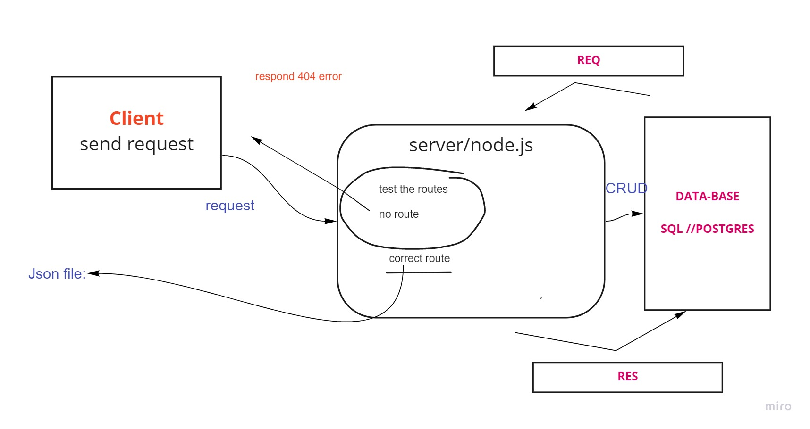

# basic-api-server class02 /lab 2
its a backend server to practice using tests units and DB:

## Deployment Test
  * HEROKU URL: https://serever-api-hanin.herokuapp.com/employee 
  * BACKEND: https://github.com/HaninHaidrah/basic-api-server  
  * PULL request: https://github.com/HaninHaidrah/basic-api-server/pull/2 

## SET UP:
> .env /PORT

## Running the app: 
> npm run dev // Endpoint: /movie,employee

## Tests:
> npm run test

## UML
*created by whiteboard online*

